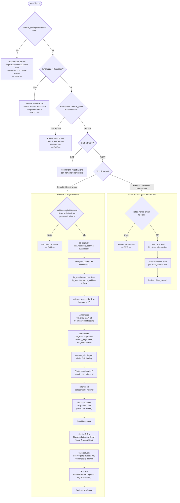

# BuildingPay — Diagramma di flusso logica applicativa
> Versione modulo: 17.0.6.0.8  
> Entry point: `/web/signup`

---

## 1. Flusso Signup

---

## 2. Flusso Portale (post-login)

```mermaid
flowchart TD
    HOME(["/my/home"]) --> ADM{is_amministratore?}
    ADM -->|No| STDP[Home portale Odoo standard]
    ADM -->|Sì| HBPSEC["Sezioni BuildingPay visibili: Contratti · Condomini · Profilo"]

    HBPSEC --> NAV{Navigazione}
    NAV --> PRF["/my/profilo"]
    NAV --> CTR["/my/contratti"]
    NAV --> CON["/my/condomini"]

    subgraph PROFILO["Profilo /my/profilo"]
        P_SHOW["Mostra: CF, P.IVA, PEC, IBAN foro_competente, applicativo sistema_pagamento, note"]
        P_SHOW --> P_POST["POST /my/profilo/save"]
        P_POST --> P_IBAN{IBAN valido?}
        P_IBAN -->|No| P_ERR[Redirect ?error=iban_invalid]
        P_IBAN -->|OK| P_WR["Aggiorna partner res.partner.bank crea / aggiorna IBAN"]
        P_WR --> P_OK[Redirect ?success=1]
    end

    subgraph CONTRATTI["Contratti /my/contratti"]
        CT_SHOW["Carica flag da partner accordo_retrocessioni_forzato accordo_condomini_forzato"]

        CT_SHOW --> C1H{accordo_retrocessioni _forzato?}
        C1H -->|Sì| C1_FORCE["Card Accordo Amm. nascosta 'Elaborato dal nostro ufficio'"]
        C1H -->|No| C1_ED{accordo_retrocessioni _ed?}
        C1_ED -->|No| C1_DL["Download PDF (NOME / CF / IBAN / ABI / CAB / DATA compilati da partner)"]
        C1_DL --> C1_UL["Upload file firmato /retrocessioni/upload"]
        C1_UL --> C1_SET["accordo_retrocessioni_ed = True Attività ToDo assegnatari (fino a 4)"]
        C1_ED -->|Sì| C1_DONE["Mostra file caricato + data upload"]

        CT_SHOW --> C2H{accordo_condomini _forzato?}
        C2H -->|Sì| C2_FORCE["Card Condomini nascosta 'Elaborato dal nostro ufficio'"]
        C2H -->|No| C2_ED{accordo_condomini _aggregati_ed?}
        C2_ED -->|No| C2_DL["Download PDF (NOME / CF / Allegato A [foro] → foro_competente o 50 underscore se vuoto)"]
        C2_DL --> C2_UL["Upload file firmato /condomini-aggregati/upload"]
        C2_UL --> C2_SET["accordo_condomini_aggregati_ed = True"]
        C2_ED -->|Sì| C2_DONE["Mostra file caricato"]
    end

    subgraph BACKOFFICE["BackOffice — group_buildingpay_manager"]
        BO_VAL["Imposta is_amministratore_validato = True (abilita creazione condomini)"]

        BO1_ON["accordo_retrocessioni_forzato = ON"]
        BO1_ON --> BO1_SET["accordo_retrocessioni_ed = True log chatter data/utente campo PeS upload visibile"]
        BO1_OFF["accordo_retrocessioni_forzato = OFF"]
        BO1_OFF --> BO1_CHK{File caricato dall'admin?}
        BO1_CHK -->|No| BO1_RST["accordo_retrocessioni_ed = False log chatter"]
        BO1_CHK -->|Sì| BO1_KEEP["_ed rimane True log chatter"]

        BO2_ON["accordo_condomini_forzato = ON"]
        BO2_ON --> BO2_SET["accordo_condomini_aggregati_ed = True log chatter data/utente campo PeS upload visibile"]
        BO2_OFF["accordo_condomini_forzato = OFF"]
        BO2_OFF --> BO2_CHK{File caricato dall'admin?}
        BO2_CHK -->|No| BO2_RST["accordo_condomini_aggregati_ed = False log chatter"]
        BO2_CHK -->|Sì| BO2_KEEP["_ed rimane True log chatter"]

        BO_COND["Condizioni economiche bp_* reset da Config BuildingPay (pulsante singolo o azione massiva)"]
    end

    subgraph CONDOMINI["Condomini /my/condomini"]
        CN_LIST["Lista condomini attivi (parent_id = partner, type = condominio)"]
        CN_LIST --> CN_ACT{Azione}
        CN_ACT --> CN_NEW["Nuovo /my/condomini/new/save"]
        CN_ACT --> CN_EDT["Modifica /my/condomini/id/save"]
        CN_ACT --> CN_ARC["Archivia /my/condomini/id/archive"]

        CN_NEW --> CN_VAL{Valida: nome, via città, CAP, CF IBAN principale}
        CN_VAL -->|Errori| CN_FORM[Ri-mostra form con errori]
        CN_VAL -->|OK| CN_CRE["Crea res.partner (type = condominio) IBAN principale + secondario flag e-invoice se cod.dest. presente"]
        CN_CRE --> CN_OK[Redirect ?success_add=1]

        CN_EDT --> CN_UPD["Aggiorna dati IBAN principale / secondario (rimuove IBAN2 se svuotato)"]
        CN_ARC --> CN_DEL["active = False archiviazione soft"]
    end
```

---

## Legenda relazioni chiave

| Elemento | Modello / Campo | Dove agisce |
|---|---|---|
| `is_amministratore` | `res.partner` | Gate di accesso a tutte le sezioni portale BP |
| `is_amministratore_validato` | `res.partner` | Impostato `False` al signup; `True` da backoffice dopo verifica |
| `foro_competente` | `res.partner` | Compilato al signup / profilo → sostituisce `[foro]` nel PDF Condomini |
| `bp_costo_email`, `bp_costo_rendicontazione`, `bp_costo_whatsapp`, `bp_quota_fissa` | `res.partner` | Default da Config BP al signup; personalizzabili per admin; reset massivo |
| `accordo_retrocessioni_forzato` | `res.partner` | Solo backoffice → nasconde card portale + setta `_ed=True` + log chatter |
| `accordo_condomini_forzato` | `res.partner` | Solo backoffice → nasconde card portale + setta `_ed=True` + log chatter |
| `project_id` + `delivery_responsible_id` | `buildingpay_v36.config` | Usati al signup per creare il task delivery automatico |
| CRM lead | `crm.lead` | Creato per richieste info (intent=info) e per ogni nuova registrazione |
| Task delivery | `project.task` | Creato nel progetto BP configurato al momento del signup |

---

## File di riferimento nel modulo

| File | Responsabilità |
|---|---|
| `controllers/portal_auth.py` | Signup, validazioni, do_signup, setup partner, azioni post-registrazione |
| `controllers/portal_main.py` | Portale: contratti, profilo, condomini |
| `models/res_partner.py` | Campi custom, `create()` / `write()` con logica force flag e default bp_* |
| `models/buildingpay_config.py` | Configurazione singleton per sito web |
| `templates/portal_registration.xml` | Form signup (referrer, foro_competente, layout CAP/Città/Provincia) |
| `templates/portal_contratto.xml` | Render contratti con gestione flag forzatura |
| `templates/portal_profilo.xml` | Form modifica dati personali |
| `templates/portal_condomini.xml` | Lista e form condomini |
